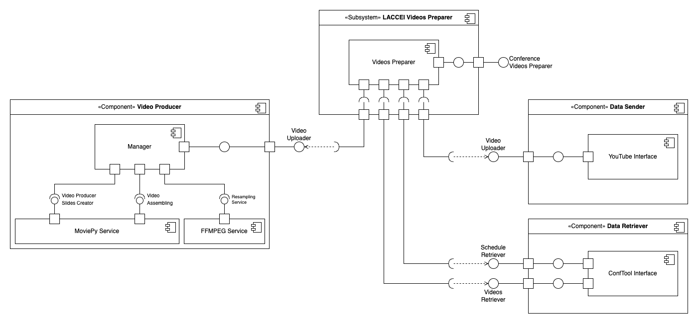

# LACCEI Video Preparer Design

The LACCEI Video Preparer is a module that assists in preparing videos for virtual conference sessions.

This document describes a design that aims to create intuitive software that automates the creation of these videos. The process involves
- gathering original videos,
- adhering to a schedule for video preparation,
- and uploading them to the target platform, YouTube.

The figure below shows the overall intended system design. 

